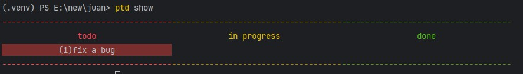
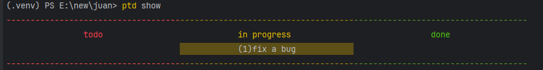
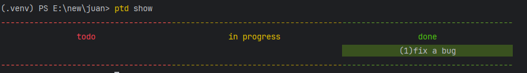

# PTD

ptd is a python tiny command line todo list inspire by the *Silicon Valley* TV series.

it just a demo now, i will write it again by C(hopefully) 

the real todo list for this project:

* add some testcase for it
* make deadline useful in `ptd show` or others command.
* ...

###  quickstart

**install**

```shell
git clone https://github.com/r1cardohj/ptd.git
pip install --editable
```

**initialize**

```shell
ptd init
```

**Add a todo item**

``` shell
ptd add
Please enter a title: fix a bug
Please enter a deadline: 2024-03-23
```



**Start a todo item**

you should use the id before title to start a todo item.

``` shell
ptd start 1
ptd show
```




**Done a todo item**

``` shell
ptd done 1
ptd show
```

you will see the amazing green  haha...



**Drop a todo item**

``` shell
ptd drop 1
```

